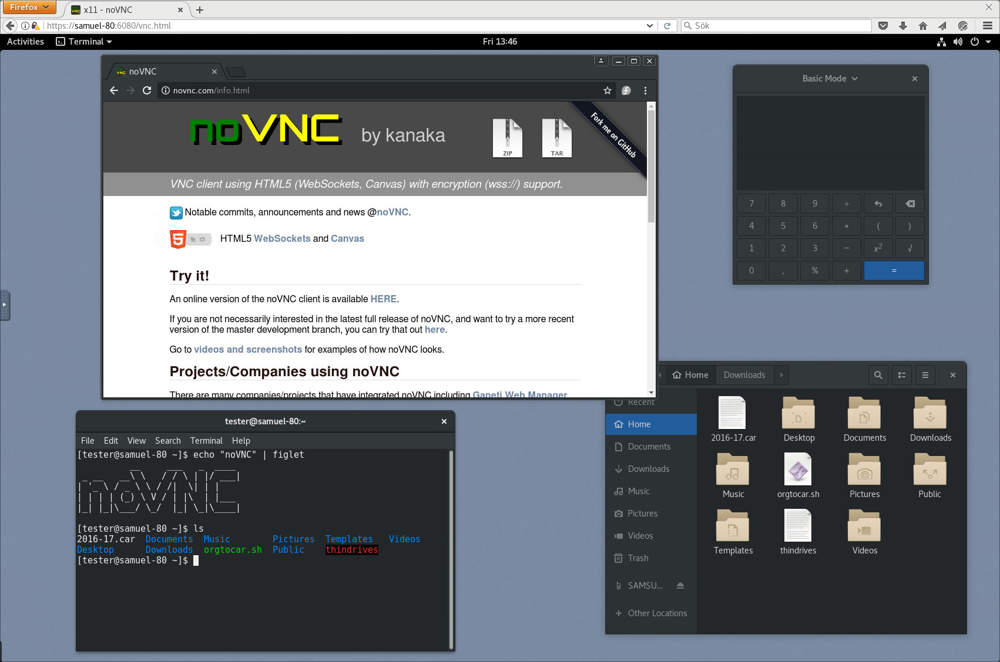

## About

[_NoVNC_](https://novnc.com/info.html) is a HTML VNC client. This add-on can handle multiples instances. 


## Installation

The installation of this add-on is pretty straightforward and not different in
comparison to installing any other [_Hass.io_](https://www.home-assistant.io/hassio/) add-on.




## Configuration

Each parameter is mandatory (name, host, port). Add entry in settings array for each vnc server. 

**Note**: _Remember to restart the add-on after changing the configuration._

Example add-on configuration:

```json
{
  "settings": [
    {
      "name": "Hanbrake",
      "host": "192.168.0.143",
      "port": 5900
    },
    {
      "name": "JDownloader 2",
      "host": "192.168.0.143",
      "port": 5901
    }
  ]
}
```

## [_Proxmox VE_](https://www.proxmox.com/proxmox-ve)

_Proxmox VE_ already use NoVNC to control VMs in his own web interface, but it is possible to enable the VNC access. 

_Proxmox VE_ wiki : [https://pve.proxmox.com/wiki/VNC_Client_Access](https://pve.proxmox.com/wiki/VNC_Client_Access)
